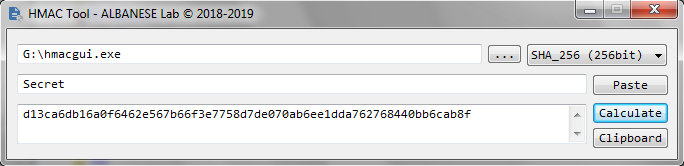

# HMAC Cryptographic Function

### Compute Hash-based Message Authentication Code of files
Algorithms: MD5, SHA1, SHA-256, SHA-384, SHA-512, RMD160

#### CLI
<PRE>Usage:
  hmac.exe --in &lt;file.ext&gt; [--alg &lt;algorithm&gt;] [--key &lt;secretkey&gt;]</PRE>
#### GUI

 </img>

## License

This project is licensed under the ISC License.

##### Commercial-Grade Reliability. Copyright (c) 2018-2022 ALBANESE Research Lab.
